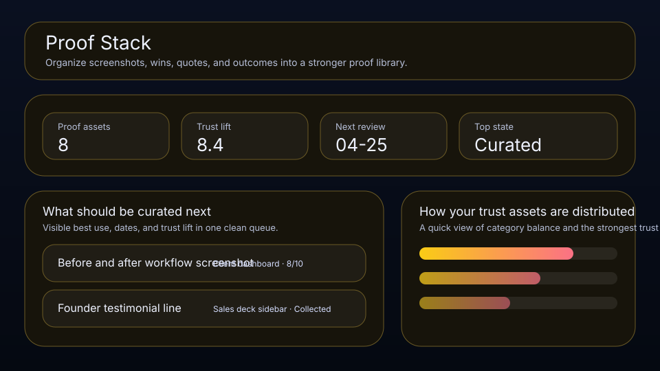

# Proof Stack

Organize screenshots, wins, quotes, and outcomes into a stronger proof library.



Proof Stack is a local-first workspace for founders, operators, and solo builders who want a cleaner way to manage proof assets. It keeps trust lift, source, best use, and review timing visible so the right things move forward with less drift.

## What it does

- ranks proof assets by leverage, trust lift, timing, and friction
- tracks **source**, **best use**, **review date**, and **trust lift** for each proof asset
- highlights the best current bet, the next review slot, and the strongest signal on the board
- renders a dedicated queue plus a category mix snapshot beneath the main board
- saves locally in the browser with JSON import/export backups
- quick action: **Curate asset**
- quick action: **Raise trust lift**
- quick action: **Mark ready**

## Why it feels different

Proof Stack is not just a generic list. It is shaped around the real workflow behind proof assets, so the board helps you decide what matters next instead of simply storing records.

## Quick start

```bash
git clone https://github.com/get2salam/proof-stack.git
cd proof-stack
python -m http.server 8000
```

Then open <http://localhost:8000>.

## Keyboard shortcuts

- `N` creates a new proof asset
- `/` focuses the search box

## Privacy

Everything stays in your browser unless you export a JSON backup.

## License

MIT
